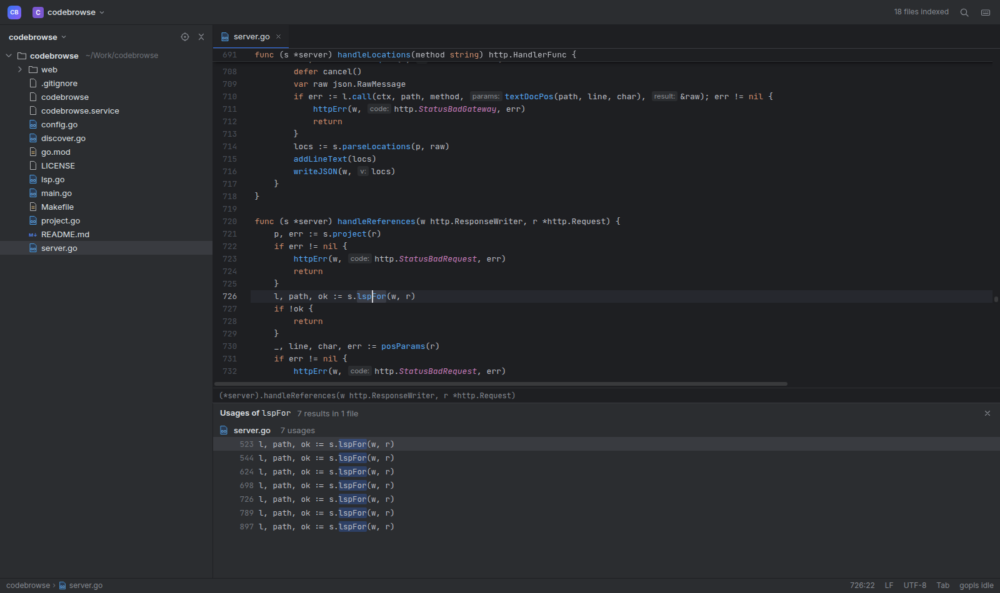

# codebrowse

A small, read-only, IntelliJ-style code browser for Go that runs in your browser. It's handy when your code lives on a remote dev box or VM and you want to read it, jump around and find usages without starting an IDE.



It is a single Go binary with no dependencies outside the standard library. The frontend is embedded and written in plain JavaScript with no build step. All navigation comes from [gopls](https://pkg.go.dev/golang.org/x/tools/gopls), Go's language server, so go-to-definition and find-usages are type-accurate, including across modules in a `go.work` and into the standard library or module cache.

## Features

- **Ctrl+Click** goes to the declaration. Ctrl+Click on a declaration shows its usages instead.
- **Ctrl+G** shows the usages of the symbol at the caret in a pane at the bottom. If there is exactly one usage, it jumps straight there.
- **Ctrl+B** goes to the declaration and **Ctrl+Alt+B** goes to the implementations.
- **Alt+←/→** (or the mouse back button) goes back and forward. Every jump is a browser history entry.
- **Double Shift / Ctrl+P** searches for files. Press Tab to switch to workspace symbols or the current file's structure. You can type `name:123` or `:123` to go to a line.
- **Ctrl+E** shows recent files, **Ctrl+F12** shows the file structure, **Alt+F1** selects the open file in the tree, and **Esc** closes popups.
- **Display:**
  - IntelliJ "New UI" dark theme with semantic highlighting.
  - Parameter-name hints (`msg:`), hover docs, and highlighting of every occurrence of the symbol at the caret.
  - The enclosing function header stays pinned at the top while you scroll.
- **Project tree:**
  - Shows the git branch of every repo or worktree folder, with a ★ if it has uncommitted changes to tracked files.
  - Hides `.git`, `node_modules`, gitignored paths and generated files (`// Code generated ... DO NOT EDIT.`). The project menu can show them again.
- **Projects:**
  - Added from the project dropdown, or discovered automatically from globs such as `~/src/*`.
  - Indexed in the background and re-indexed periodically. gopls is told when files change on disk.

Other file types (Markdown, YAML, JS/TS, SQL, proto, …) get basic syntax highlighting but no navigation.

## Requirements

- Linux with systemd (user services). macOS works if you run the binary directly.
- Go 1.24+ and `git`.
- gopls: `go install golang.org/x/tools/gopls@latest`.

## Install

```sh
git clone https://github.com/binwiederhier/codebrowse
cd codebrowse
make install    # builds, installs ~/.local/bin/codebrowse, enables + starts the systemd user service
make password   # prints the generated login password
```

Then open http://127.0.0.1:7878 and add a project.

To keep the service running after you log out of the machine, enable lingering: `loginctl enable-linger $USER`.

Other targets: `make restart` rebuilds and restarts, `make logs` follows the journal, and `make uninstall` removes the binary and the unit. Uninstall leaves the config in place.

## Configuration

The config file is `~/.config/codebrowse/config.json`. It is created on first start; restart the service after editing it.

```json
{
  "listen": "127.0.0.1:7878",
  "password": "generated-on-first-start",
  "secret": "generated-on-first-start",
  "projects": [
    { "id": "myproject", "name": "myproject", "path": "/home/me/src/myproject" }
  ],
  "discover": ["~/src/*", "~/work"],
  "hidden": []
}
```

| Key | Meaning |
| --- | --- |
| `listen` | Address to listen on. The default only accepts local connections; use `0.0.0.0:7878` to reach it from another machine. |
| `password` | Login password. Changing it logs out all sessions. |
| `secret` | HMAC key for the session cookie. Don't share it. |
| `projects` | Projects added by hand, through the UI or this file. |
| `discover` | Globs. Every matching directory becomes a project; this is checked every 30s. |
| `hidden` | Discovered directories you removed from the project list. |

Resource use:
- **Indexing:** a project is not indexed until you first open it, and stops re-indexing after 30 minutes without use.
- **gopls:**
  - At most 2 gopls processes run at once, each capped with `GOMEMLIMIT=2GiB`.
  - An idle gopls process exits after 45 minutes.
  - A large `go.work` can use 1-2 GB.

## Security

codebrowse serves source code, so treat it like SSH access:

- Every page and API call needs the password. After login, a session cookie lasts 90 days.
- Files can only be read inside a configured project, `GOROOT` or `GOMODCACHE`.
- There is **no TLS**. If you bind to `0.0.0.0`, the password and your code travel unencrypted. Prefer `127.0.0.1` plus an SSH tunnel (`ssh -L 7878:localhost:7878 devbox`), or put it behind a TLS reverse proxy.
- Anyone who can log in can add any directory the service user can read as a project.

## Development

```sh
go build -o codebrowse . && ./codebrowse -config /tmp/cb.json   # run a dev instance with its own config
make restart                                                    # deploy to the user service
```

| File | Purpose |
| --- | --- |
| `main.go`, `config.go` | Flags, config file, startup. |
| `server.go` | HTTP routes, auth and the JSON API. |
| `project.go` | Indexing, ignore rules, git branch/dirty status, fuzzy file search. |
| `discover.go` | Project auto-discovery. |
| `lsp.go` | A minimal LSP client for gopls (JSON-RPC over stdio). |
| `web/` | The UI: `index.html`, `app.css`, `app.js`. |

## Instructions for Claude (AI coding agents)

If a user asks you to install or set up codebrowse for them, do the following:

1. **Check prerequisites.**
   - Run `go version` and `git --version`, and check for gopls with `command -v gopls || ls ~/go/bin/gopls`.
   - If gopls is missing, ask the user before installing it with `go install golang.org/x/tools/gopls@latest`.
   - If `systemctl --user` doesn't work (for example on macOS or in a container), skip the service: build with `go build -o codebrowse .` and tell the user how to run it.
2. **Ask the user two things.**
   - **Network access.** Will they open it from the same machine or over an SSH tunnel? Then keep `127.0.0.1:7878`. If they want to open it from another machine directly, use `0.0.0.0:7878`, and tell them it's password-protected but unencrypted HTTP.
   - **Projects.** Which directories hold their code? Single repos or workspaces become `projects` entries. Parent directories whose subfolders should each be a project become `discover` globs such as `~/src/*`.
3. **Install.**
   - Clone the repo (or use the current checkout) and run `make install`. This creates `~/.config/codebrowse/config.json`.
   - Edit that file to set `listen`, `discover` and/or `projects`. Keep the generated `password` and `secret`.
   - Run `systemctl --user restart codebrowse`.
4. **Keep it running after logout.**
   - Check `loginctl show-user $USER -p Linger`.
   - If it says `Linger=no`, offer to run `loginctl enable-linger $USER`. It may need sudo.
5. **Verify.**
   - Check that `systemctl --user is-active codebrowse` reports `active`.
   - Run `journalctl --user -u codebrowse -n 20` and look for an `indexed project` line.
   - Log in with `curl -s -c /tmp/cb.cookies -d password=$(~/.local/bin/codebrowse -print-password) http://127.0.0.1:7878/login`.
   - Then `curl -s -b /tmp/cb.cookies http://127.0.0.1:7878/api/projects` should list the projects.
6. **Report back.** Give the user the URL, the password (`make password`), and the key shortcuts: Ctrl+Click, Ctrl+G, Double Shift, Alt+←.

When changing the code:
- The backend is stdlib-only Go and the frontend is dependency-free JavaScript. Keep it that way; don't add npm packages or Go modules without asking.
- Run `go vet ./...` and `node --check web/app.js` before `make restart`.
- To check UI changes, drive a real browser (for example with Playwright) against a dev instance on another port. Don't only reason about the code.

## License

Apache 2.0, see [LICENSE](LICENSE).
